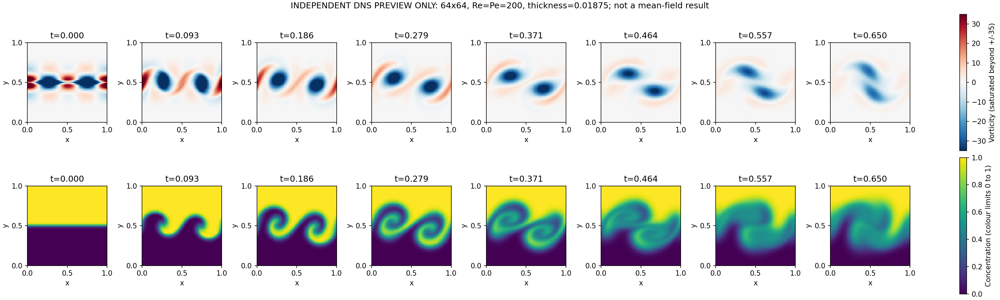

# 64×64 higher-Re/Pe mixing layer: launch record

This case increases **Re and Pe from 50 to 200**, as requested, while keeping
the completed 64×64 setup otherwise unchanged. It reduces both viscosity and
scalar diffusivity by a factor of four, from 0.02 to 0.005.

## Completion update

Production job **11244737** completed successfully (exit 0) on `htc-n80` in
**24 hours 36 minutes 12 seconds**. It resumed the saved step-3 local kets from
successful preflight job **11244728** and completed all 1,040 steps to t=0.65,
validation, matched DNS comparison, and plotting. `postprocess_status.json`
is `complete`. See the [completed report and plots](./RUN_REPORT.md).

The mean-field solution shows clear spiral roll-up and stronger mutual vortex
rotation, but two distinct cores remain at the final time. The final vorticity
MF/DNS difference is 11.71% in relative L2, and concentration overshoots remain;
grid and timestep convergence have not been established.

The configuration, DNS preview, and preflight timings below preserve the
launch history. Startup estimates are not the current run status. Production
was submitted with an `afterok:11244728` dependency, satisfied before it ran.

## Configuration

| Parameter | Value |
|---|---|
| Grid | 64×64 unit-square MAC cells |
| Reynolds / Péclet | Re=Pe=200 |
| Shear | One tanh layer, y=0.5, thickness 0.01875 |
| Boundaries | Periodic x; free-slip/no-flux y |
| KH seeds | Width 0.12; mode 2 amplitude 2.5; mode 1 amplitude 0.5; phase zero |
| Physical timestep / end time | 0.000625 / 0.65; 1,040 steps |
| Bosons | 16,448 explicit single-site Fock vectors; cutoff 12, dimension 13 |
| Encoding scales | Velocity 8, pressure impulse 4, concentration 4 |
| Predictor/correction | Eight local-state RK4 subdivisions each |
| Pressure relaxation | Pseudo-step 0.125/64², residual tolerance 1e-8, cap 48,000 |
| Production resources | One `turin` CPU, 4 GiB, 48-hour allocation |

The three mean-field production modules and every numerical acceptance gate
are unchanged. Predictor, pressure relaxation, and correction all evolve local
kets with explicit creation, annihilation, and identity operators. There is
no TDVP, direct pressure inversion, amplitude-only evolution, coherent-state
resetting, or concentration clipping/mass repair in the mean-field algorithm.

## Independent DNS preview — not a mean-field result



This exploratory DNS calculation used the same configuration and initial
physical fields measured from the initially encoded local Fock vectors. It
completed 1,040 steps to t=0.65 and passed its fixed-timestep, mass,
divergence, pressure-gauge, and wall checks. Maximum raw relative mass drift
was 2.22e-16 and maximum relative divergence was 5.72e-17. Its numerical
evolution uses the standalone projected-midpoint DNS, **not** mean-field
operators, and is never called as a stage of the mean-field solver.

Spatial inspection shows much clearer spiral roll-up and stronger interaction
between the two vortices than at Re=Pe=50. A completed merger is not established
by t=0.65. The all-step concentration range was [-0.0589956, 1.058996]. These
roughly 6% overshoots are a limitation of centered, non-bound-preserving
transport; the data were not clipped or mass-corrected. Figure colour limits
are 0–1 for concentration and -35 to 35 for vorticity, so values beyond those
limits are visually saturated. No grid or timestep convergence is claimed.

The preview does not replace the completed post-run matched DNS comparison,
which started from the saved, validated mean-field initial observables.

## Status and outputs

The persistent simulation directory is
`/ix/jmendoza-arenas/hia21/mixing-layer/mean-field-sites64-re200-pe200-single-freeslip-delta001875-largekh-nb12`.
The preflight log is `mf64_re200_preflight.11244728.log` in the repository root.
The production log is `mf64_re200.11244737.log`. Its initial Slurm
`PENDING (Dependency)` state was intentional, not a solver failure.
Inspect the completed jobs with:

```bash
sacct --clusters=htc -j 11244728,11244737 --format=JobID,State,ExitCode,Elapsed
```

The completed Re=Pe=50 run and its data remain intact in their own directories.

The first two accepted preflight steps passed all numerical gates. Their
cumulative times were 132.35 and 210.16 seconds (77.81 seconds for the second
step). The measured initial velocity and concentration fields are bitwise
identical to the Re=Pe=50 run, and the only changed configuration entries are
Re and Pe. The three frozen production source files are also byte-identical
to that run. Source/configuration fingerprints and checkpoint quality were
checked before scheduling continuation. All 42 Python tests pass.

The third accepted step finished at 285.90 seconds of stepping time, and the
complete preflight allocation lasted 4 minutes 59 seconds on `htc-n77`.
Warm steps took about 76–78 seconds. Peak memory reported by `/usr/bin/time`
was 121,296 KiB (about 118 MiB). The preflight estimate was roughly a day for
the full trajectory, allowing for changes in pressure iterations and node
speed; the allocation provided 48 hours and checkpoint/restart.
All three accepted-step gates and the source/configuration fingerprint were
rechecked after the preflight completed:

- Maximum raw relative scalar-mass drift: 1.11e-16.
- Maximum relative divergence: 2.53e-11.
- Maximum pressure residual: 9.99e-9 (limit 1e-8).
- Maximum coherent-eigenstate defect: 6.44e-11.
- Wall-normal velocity and imaginary amplitudes: exactly zero.

The batch pipeline checks the plotting environment on the compute node and
freezes the production and post-processing source files. It saves local-ket
checkpoints, validates the finished trajectory, and only then runs the separate
matched DNS comparison and publishes the MF plots and `RUN_REPORT.md` here.
`postprocess_status.json` must say `complete` before treating that publication
as finished. A partial checkpoint or this DNS preview is not a final MF result.
The Slurm run and post-processing can proceed without an open assistant session.
