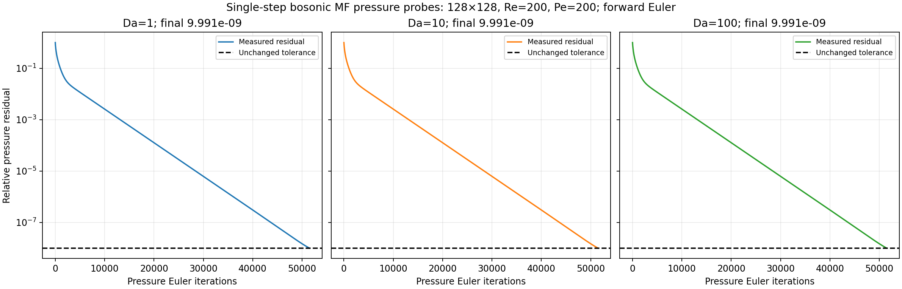

# 128×128 forward-Euler DNS and mean-field pressure checks

Re=200, Pe=200; Da=1,10,100. Physical dt=0.0003125, end time 0.65, tanh thickness 0.01875. KH seeds and periodic-x/free-slip-y boundaries are unchanged. c2(0)=1-c1(0), c3(0)=0; all three species share Pe. No clipping or mass repair.

The DNS checks span the full physical interval. The mean-field results below are **one-step startup diagnostics only**, not completed trajectories or a full MF/DNS field comparison.

## DNS negativity

| Da | Completed steps | Min c1 | Min c2 | Min c3 | Max invariant drift |
|---|---|---|---|---|---|
| 1 | 2080 | 0 | 0 | 0 | 2.220e-16 |
| 10 | 2080 | 0 | 0 | 0 | 2.220e-16 |
| 100 | 2080 | -0.0018391447 | -0.0018391447 | 0 | 2.220e-16 |

Extrema include initialization and every accepted DNS step. These runs do not establish general positivity or grid/timestep convergence.

## Mean-field pressure convergence

All MF stages use explicit local Fock vectors and forward Euler. The pressure tolerance is 1.0e-08, pseudo-step 0.125/128², and iteration cap 192,000. Predictor and correction each use 8 and 8 Euler subdivisions, respectively. No direct pressure solve, coherent reset, or tolerance relaxation is used.

| Da | Slurm job | Iterations | Final residual | Pressure converged | Full candidate accepted |
|---|---|---|---|---|---|
| 1 | 11431433 | 51,480 | 9.990595972e-09 | True | True |
| 10 | 11431434 | 51,480 | 9.990596573e-09 | True | True |
| 100 | 11431435 | 51,480 | 9.990596362e-09 | True | True |

### Da=1

Final relative divergence: 8.877e-10; invariant drift: 1.085e-11; coherent-eigenstate defect: 5.287e-06.

[Complete probe](./mf_euler_probe_da1_substeps8.json) · [DNS screening report](./dns_preflight_da1.json).

### Da=10

Final relative divergence: 8.877e-10; invariant drift: 1.008e-10; coherent-eigenstate defect: 5.287e-06.

[Complete probe](./mf_euler_probe_da10_substeps8.json) · [DNS screening report](./dns_preflight_da10.json).

### Da=100

Final relative divergence: 8.877e-10; invariant drift: 1.113e-09; coherent-eigenstate defect: 6.995e-06.

[Complete probe](./mf_euler_probe_da100_substeps8.json) · [DNS screening report](./dns_preflight_da100.json).

Pressure convergence is necessary but not sufficient for accepting a mean-field step. Slurm exit 0 for a diagnostic means the probe finished, not that every gate passed. No full MF run is implied by this report.

[Pressure history CSV](./pressure_convergence.csv) · [Setup and status](./STATUS.md)
